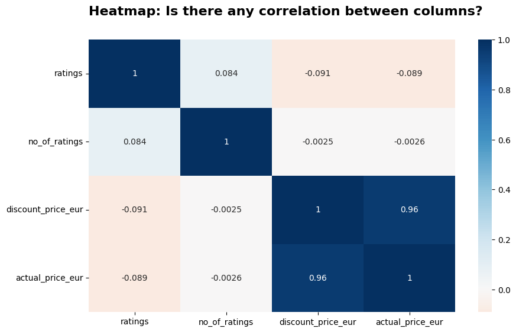

# **Project Overview**
### **Project Title:** Amazon Products Analysis - Insights into the Indian E-Commerce Market

### **Tools and Technologies:** Python, Pandas, Matplotlib, Seaborn

## **Introduction**
This project delves into a comprehensive analysis of a dataset collected from the Indian Amazon website in 2023, aiming to unravel market dynamics, consumer behaviors, and strategic business opportunities. The primary objective was to identify the most popular product categories and brands and analyze the impact of pricing, discounts, and reviews on purchasing behavior.

## **Dataset and Data Source**
The dataset comprises 1,103,170 entries across 142 product categories, containing information such as product name, category, price, and customer ratings. Data cleaning involved addressing missing values, currency conversions, removing outliers and duplicates, and transforming non-numeric data.

## **Insights**

Analyzing a comprehensive dataset from Amazon's Indian marketplace in 2023 offered fascinating insights into consumer behaviors, market dynamics, and the competitive landscape of e-commerce in India. This analysis employed a diverse range of visualization techniques, including box plots, histograms, heatmaps, scatter plots, KDE plots, bar plots, pie plots, and violin plots, each contributing uniquely to understanding the dataset's complexities.

  
  

The number of products by main category analysis revealed a high consumer interest in "Accessories" and "Women's Clothing," indicating these as major draws for e-commerce traffic and sales. However, the high product count in "Accessories" suggests a possibly saturated market, presenting challenges and opportunities for differentiation and competitive pricing strategies. Meanwhile, categories like "TV, Audio & Cameras" and "Appliances" highlighted the importance of technology and home improvement products, reflecting trends in consumer electronics and home aesthetics.

  
  

The number of unique subcategories within main categories like "Sports & Fitness" and "Home & Kitchen" pointed to a highly segmented market, offering opportunities for retailers to cater to niche preferences. This segmentation suggests that while some categories may be broad and appeal to a wide audience, others, such as "Music" or "Pet Supplies," target more specific consumer needs.

  
  

Product distribution by subcategory showed particular dominance in areas like "Ethnic Wear," suggesting specific consumer preferences that could be capitalized upon. Meanwhile, the analysis of brands by the number of products offered insights into market positioning, with brands like PC Jeweller, Puma, and Shopnet showcasing extensive product ranges, indicating a strong market presence.

  
  

Customer ratings analysis across main categories and subcategories, using violin plots, provided a nuanced view of consumer satisfaction. Brands like Nike, Puma, and Amazon emerged with high average ratings, underscoring the importance of brand reputation and product quality in driving customer satisfaction.

  
  

The correlation matrix revealed interesting dynamics, such as the weak correlation between price and ratings, suggesting that higher prices don't necessarily equate to higher satisfaction, and vice versa. This highlights the multifaceted nature of consumer decision-making, where factors beyond price, such as brand loyalty, product quality, and personal preferences, play critical roles.

  
  

In conclusion, this dataset analysis from Amazon India provides a rich tapestry of insights into the e-commerce landscape. It not only sheds light on consumer preferences and market saturation but also highlights the competitive positioning of brands and the nuanced relationship between price, product range, and customer satisfaction. For new entrants and established players alike, understanding these dynamics is crucial for strategic positioning and leveraging growth opportunities in the vibrant and evolving e-commerce market.

