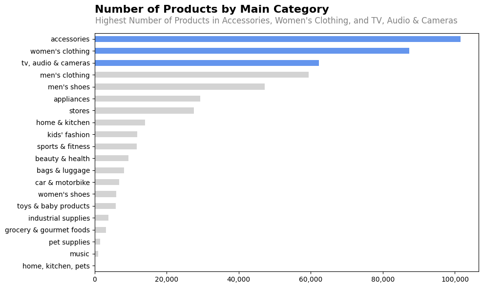
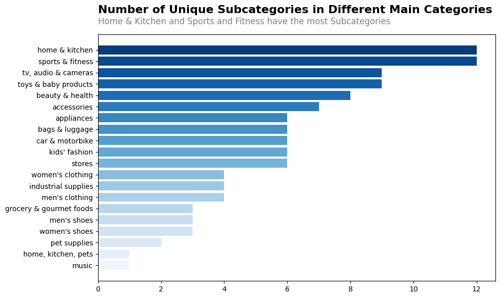
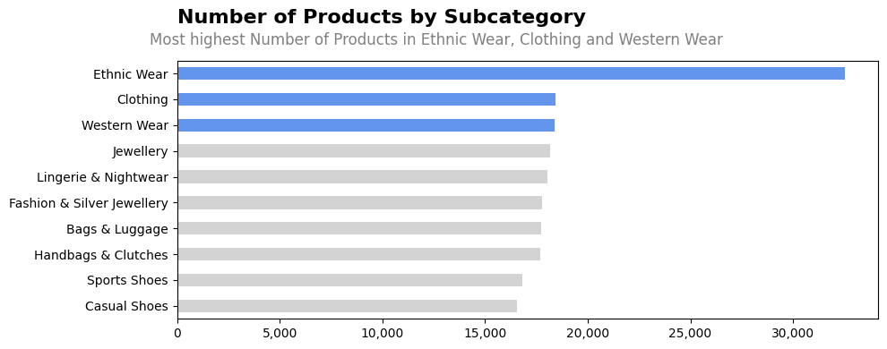
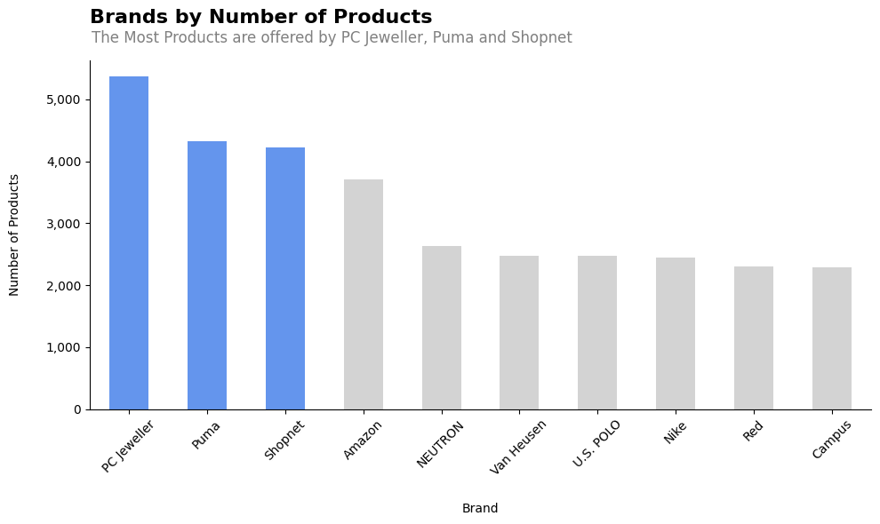
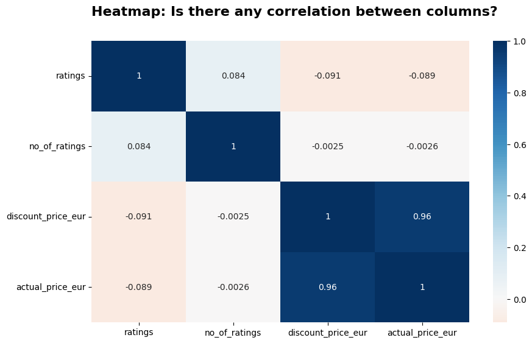
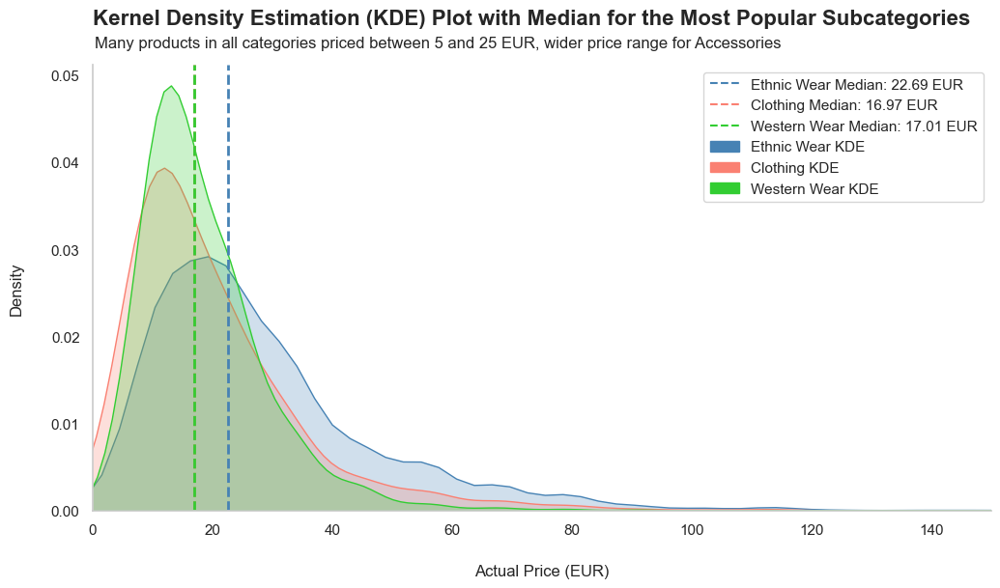
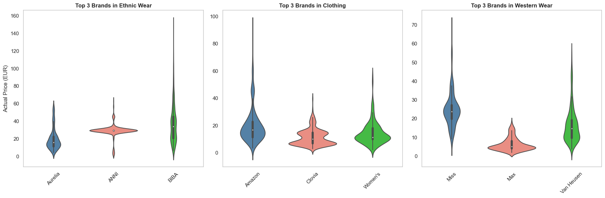
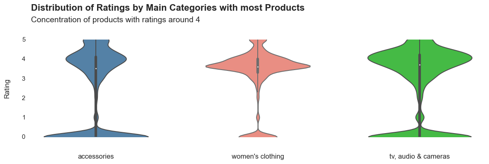
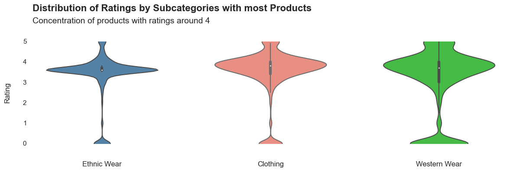

# **Amazon Products Data Analysis 2023**

## **Introduction**
This project delves into a comprehensive analysis of a dataset collected from the Indian Amazon website in 2023, aiming to unravel market dynamics, consumer behaviors, and strategic business opportunities. The primary objective was to identify the most popular product categories and brands and analyze the impact of pricing, discounts, and reviews on purchasing behavior.

## **Tools and Technologies:**
Python, Pandas, Matplotlib, Seaborn

## **Dataset**
The dataset comprises 1,103,170 entries across 142 product categories, containing information such as product name, category, price, and customer ratings. Data cleaning involved addressing missing values, currency conversions, removing outliers and duplicates, and transforming non-numeric data.

| Feature         | Description                                                     |
|-----------------|-----------------------------------------------------------------|
| name            | The name of the product                                          |
| main_category   | The main category of the product it belongs to                  |
| sub_category    | The sub-category of the product it belongs to                   |
| image           | The image of the product                                         |
| link            | The Amazon website reference link of the product                |
| ratings         | The ratings given by Amazon customers for the product            |
| no_of_ratings   | The number of ratings given to this product on Amazon            |
| discount_price  | The discount price of the product                                |
| actual_price    | The actual Manufacturer's Retail Price (MRP) of the product      |

## **Insights**
Unsere Analyse lieferte tiefe Einblicke in den indischen E-Commerce-Markt, insbesondere in Bezug auf Produktkategorien, Verbraucherverhalten und die Rolle von Marken. Hier sind einige der wichtigsten Erkenntnisse, einschließlich der Markenanalyse:

- **Marktkonzentration und Verbraucherinteresse:** Hochinteressante Bereiche für Verbraucher sind "Accessoires" und "Damenbekleidung". Diese Kategorien ziehen möglicherweise einen großen Teil des E-Commerce-Traffics und der Verkäufe an.
- **Preisstrategien und Kundenzufriedenheit:** Unsere Analyse der Preisverteilung und Kundenzufriedenheit über verschiedene Marken und Kategorien hinweg bot Einblicke in Preisstrategien und deren Einfluss auf die Kundenzufriedenheit. Es wurde deutlich, dass höhere Preise nicht notwendigerweise zu höheren Bewertungen führen, was die Bedeutung der Produktqualität und des Wertes hervorhebt.
- **Marktsättigung:** Die hohe Produktanzahl in der Kategorie "Accessoires" könnte auf einen gesättigten Markt mit intensivem Wettbewerb hinweisen. In einem solchen Umfeld müssen Unternehmen ihre Produkte differenzieren oder in Preis, Qualität und Kundenservice konkurrieren, um sich abzuheben.

- **Korrelationanalyse:**
  - **Bewertungen und Anzahl der Bewertungen:** Die Analyse zeigte eine sehr schwache positive Korrelation zwischen den durchschnittlichen Bewertungen eines Produkts und der Anzahl der Bewertungen. Dies könnte darauf hinweisen, dass Produkte mit mehr Bewertungen tendenziell leicht höhere Durchschnittsbewertungen erhalten, jedoch ist dieser Zusammenhang nicht stark genug, um signifikante Schlüsse zu ziehen.
  - **Preise und Bewertungen:** Sowohl der Rabattpreis als auch der tatsächliche Preis wiesen eine sehr schwache negative Korrelation mit den Produktbewertungen auf. Dies legt nahe, dass teurere Produkte nicht unbedingt höhere Bewertungen erhalten, was auf die Bedeutung anderer Faktoren wie Qualität und Markenwahrnehmung hinweist.
Rabatt- und tatsächliche Preise: Eine sehr starke positive Korrelation zwischen dem Rabattpreis und dem tatsächlichen Preis wurde festgestellt, was erwartet wurde, da der Rabattpreis direkt vom tatsächlichen Preis abhängt. Diese Erkenntnis bestätigt die Gültigkeit der Preisinformationen im Datensatz.

- ### **Markenanalyse:**
  - **Markenvielfalt:** PC Jeweller, Puma und Shopnet zeigten sich als Marken mit der größten Produktvielfalt. Diese Markenvielfalt deutet auf eine breite Marktpräsenz und eine Strategie hin, diversen Verbraucherbedürfnissen gerecht zu werden.
  - **Kundenzufriedenheit und Markenreputation:** Die Analyse der Kundenbewertungen offenbarte, dass Nike, Puma und Amazon die höchsten durchschnittlichen Bewertungen erhielten. Dies legt nahe, dass Produkte dieser Marken generell gut von Kunden aufgenommen werden, was auf eine starke Markenreputation und hohe Produktqualität hindeuten kann.
  - **Herausforderungen für Marken:** Trotz der allgemein guten Kundenzufriedenheit zeigten unsere Erkenisse, dass Marken wie PC Jeweller, Shopnet und NEUTRON weniger sichtbar in Bezug auf Kundenbewertungen waren, was auf Herausforderungen in der Markenwahrnehmung oder dem Marketing hinweisen könnte.

Analyzing a comprehensive dataset from Amazon's Indian marketplace in 2023 offered fascinating insights into consumer behaviors, market dynamics, and the competitive landscape of e-commerce in India. This analysis employed a diverse range of visualization techniques, including box plots, histograms, heatmaps, scatter plots, KDE plots, bar plots, pie plots, and violin plots, each contributing uniquely to understanding the dataset's complexities.

The number of products by main category analysis revealed a high consumer interest in "Accessories" and "Women's Clothing," indicating these as major draws for e-commerce traffic and sales. However, the high product count in "Accessories" suggests a possibly saturated market, presenting challenges and opportunities for differentiation and competitive pricing strategies. Meanwhile, categories like "TV, Audio & Cameras" and "Appliances" highlighted the importance of technology and home improvement products, reflecting trends in consumer electronics and home aesthetics.

The number of unique subcategories within main categories like "Sports & Fitness" and "Home & Kitchen" pointed to a highly segmented market, offering opportunities for retailers to cater to niche preferences. This segmentation suggests that while some categories may be broad and appeal to a wide audience, others, such as "Music" or "Pet Supplies," target more specific consumer needs.

Product distribution by subcategory showed particular dominance in areas like "Ethnic Wear," suggesting specific consumer preferences that could be capitalized upon. Meanwhile, the analysis of brands by the number of products offered insights into market positioning, with brands like PC Jeweller, Puma, and Shopnet showcasing extensive product ranges, indicating a strong market presence.

  
  

Customer ratings analysis across main categories and subcategories, using violin plots, provided a nuanced view of consumer satisfaction. Brands like Nike, Puma, and Amazon emerged with high average ratings, underscoring the importance of brand reputation and product quality in driving customer satisfaction.

The correlation matrix revealed interesting dynamics, such as the weak correlation between price and ratings, suggesting that higher prices don't necessarily equate to higher satisfaction, and vice versa. This highlights the multifaceted nature of consumer decision-making, where factors beyond price, such as brand loyalty, product quality, and personal preferences, play critical roles.

## Contributions

Contributions to this project are welcome. If you find any issues or want to enhance the functionality, feel free to open a pull request with your changes. Please ensure to follow the project's code of conduct.

In conclusion, this dataset analysis from Amazon India provides a rich tapestry of insights into the e-commerce landscape. It not only sheds light on consumer preferences and market saturation but also highlights the competitive positioning of brands and the nuanced relationship between price, product range, and customer satisfaction. For new entrants and established players alike, understanding these dynamics is crucial for strategic positioning and leveraging growth opportunities in the vibrant and evolving e-commerce market.

